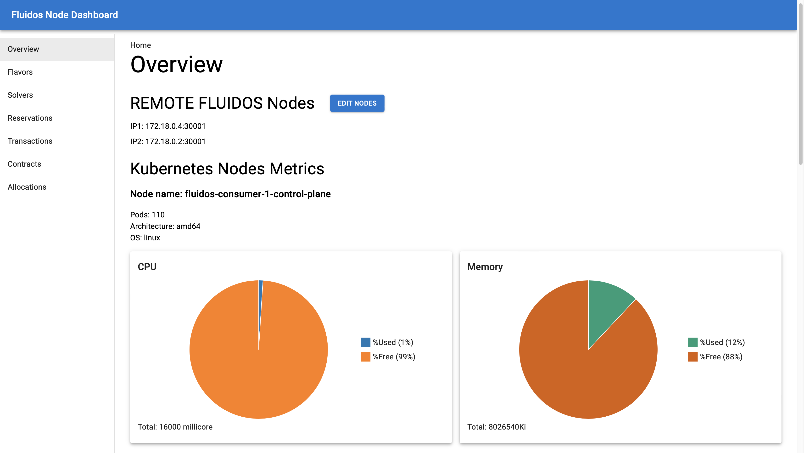
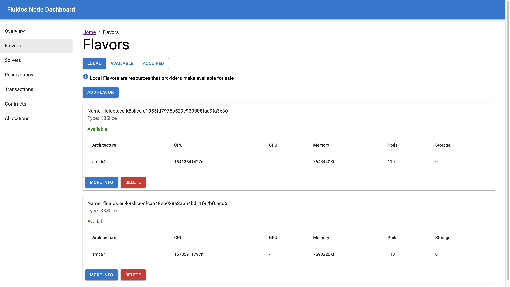
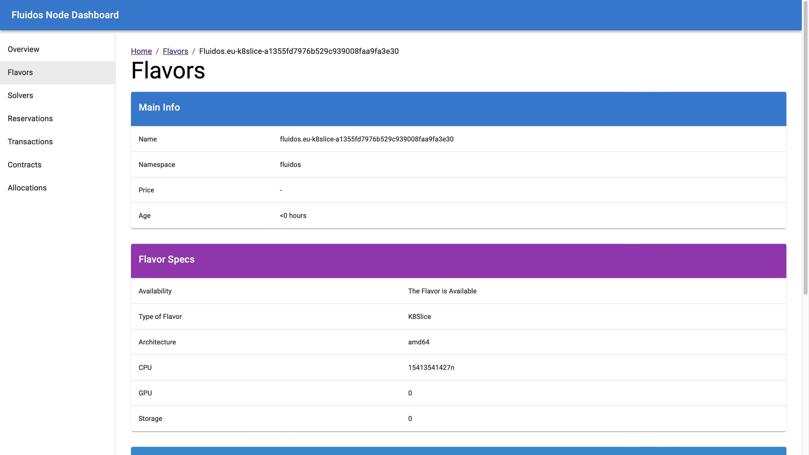
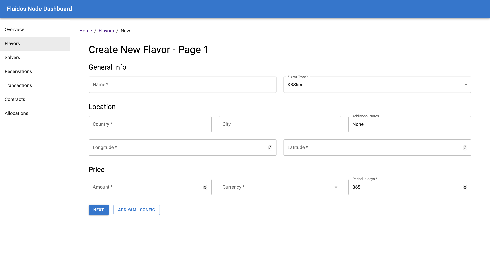

# FLUIDOS Node Dashboard

This project implements a simple dashboard for the [FLUIDOS](https://www.fluidos.eu/) project, in particular with respect to the capability to _acquire_ and _reserve_ resources throught the [REAR](https://github.com/fluidos-project/REAR) protocol.
This allows a FLUIDOS node to extend its _capabilities_, _resources_ and _services_ with the ones available in a remote node, hence creating the computing continuum proposed in FLUIDOS.

This dashboard simplifies how you interact with the most important resources defined in the FLUIDOS node, which can be used to visualize, reserve and buy resources from a remote FLUIDOS node through a GUI instead of using the Kubernetes Custom Resources underneath.

## Usage

The dashboard can be installed in a Kubernetes cluster through the manifests in `/manifest`. You need to deploy the Deployment, the Services and the Ingress.

---
In addition, remember to install an **Ingress Controller**.

We suggest you to install the NGINX Ingress Controller as following:

```bash
kubectl apply -f https://raw.githubusercontent.com/kubernetes/ingress-nginx/controller-v1.11.2/deploy/static/provider/cloud/deploy.yaml
```
---

Currently, we build and load the Docker images locally and so we suggest to use the custom installation script which speed up the overall installation process.

You need to provide a couple of arguments to the installation scripts:

1. The Kubernetes Environment (kind, k3s, kubeadm).
2. The name of the cluster if choosing kind.

**WARNING**: If you want to install it into a k3s or Kubeadm, you might need to install it with `sudo` privilege.


```bash
./install.sh <k8s-environment> <name-of-cluster-if-kind>
```

The Dashboard can also be accessed locally on your machine (at [localhost:8080](http://localhost:8080/)) through the command:

```bash
kubectl port-forward --namespace ingress-nginx service/ingress-nginx-controller 8080:80
```

In addiction, you can run the code in a development environment. Remember to export the KUBECONFIG variable before running the backend server.

## Example Images

Overview Page


Flavor Section


Flavor Details


Flavor Creation

